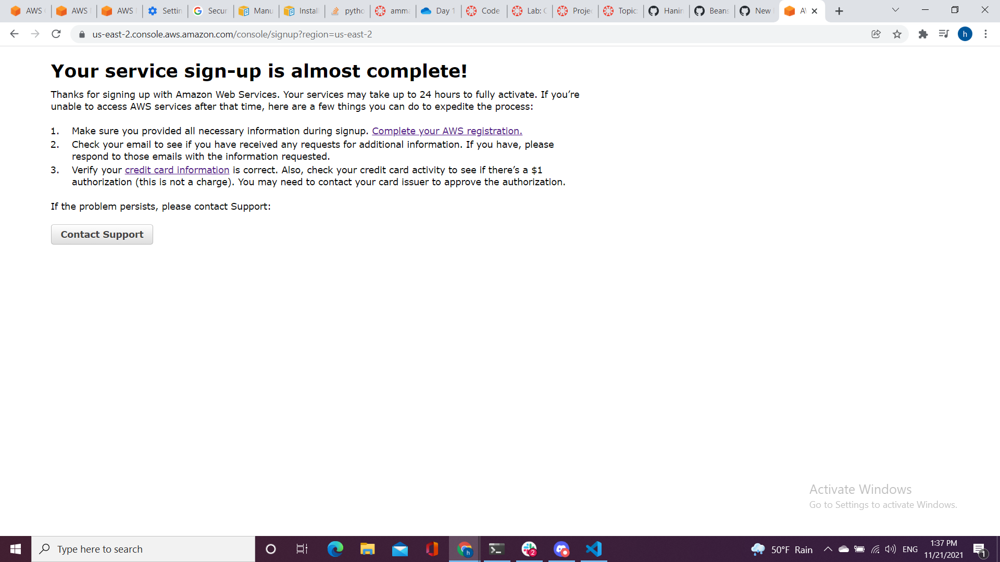
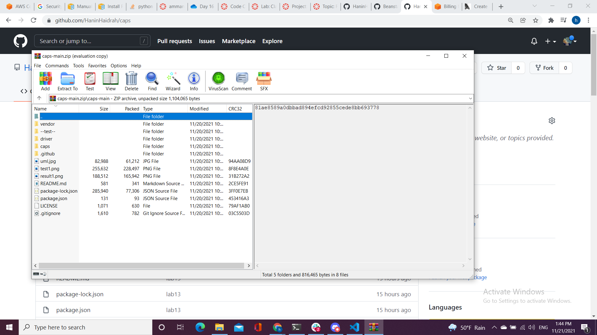
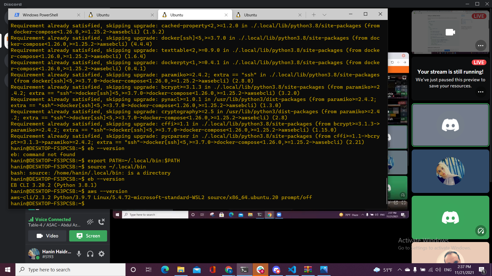

# cloud-server

## Documentation :
* The links to both of your deployed servers (GUI deploy and CLI deploy):
* GUI Deploy  : I made an account but it needs 24 hours to be verified instead of that I added to gitHub an action for deploying that .  
    - The steps:
        1. create an account 
        2. go to services choose compute 
        3. choose the beanstalk
        4. create the app_name (caps)
        5. set the enviroment 
        6. upload the ziped file for the code of caps repo 
        7. create 

 * CLI Deploy:  I downloaded both EB CLI and aws CLI 
   - The steps:
        1. eb init
        3. eb create my-environment-name
        4. answer the questions
        5. eb deploy
        